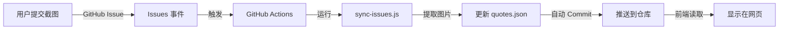

# 📱 微信金句分享墙

一个基于 **GitHub Issues + GitHub Actions** 的金句分享平台，无需Token、完全免费、安全可靠。

**在线访问：https://lcylym.github.io/weixinqunliaojinju/**

---

## ✨ 功能特性

- 📤 **一键提交** - 点击跳转 GitHub，粘贴截图即可
- 🔄 **多端同步** - 数据存储在 GitHub Issues，永久保存
- 🚫 **举报隐藏** - 举报次数达到 3 次自动隐藏
- 🎲 **随机抽取** - 随机查看一条金句
- 📊 **统计展示** - 实时显示金句数量
- 🎨 **精美界面** - 参考 Claude 风格设计
- � **安全无虞** - 无 Token 暴露风险
- ©️ **生🐟** - 用心制作

---

## 🎯 快速开始

### � 访客使用

1. 访问 https://lcylym.github.io/weixinqunliaojinju/
2. 点击"📤 上传金句"
3. 在 GitHub Issue 页面粘贴截图（Ctrl+V）
4. 勾选确认，点击 Submit
5. 等待 1-2 分钟，刷新页面查看

### 🚫 举报不当内容

1. 点击金句下方的"🚫 举报"按钮
2. 跳转到对应 Issue
3. 评论"举报"或"不当内容"
4. 举报超过 3 次自动隐藏

---

## � 管理员部署

### 方法一：Fork 本仓库

1. **Fork 仓库** 到你的账号
2. **启用 Pages**: Settings → Pages → Source: `main` branch
3. **配置 Actions**: Settings → Actions → General:
   - Workflow permissions: `Read and write`
   - 勾选 Allow GitHub Actions to create PR
4. **修改配置**: 编辑 `index.html` 中的 CONFIG:
   ```javascript
   const CONFIG = {
       REPO_OWNER: '你的用户名',
       REPO_NAME: '你的仓库名',
       BRANCH: 'main',
       WORKFLOW_FILE: 'update-quotes.yml'
   };
   ```
5. **完成！** 访问 `https://你的用户名.github.io/仓库名/`

### 方法二：从零开始

详细步骤查看 [USAGE.md](./USAGE.md) 📖

---

## 🏗️ 技术架构

### 数据流程



### 为什么改用 Issues？

**旧方案（Token）的问题**:
- ❌ Token 暴露在前端代码
- ❌ GitHub Secret Scanning 会检测并封禁
- ❌ 需要用户手动配置，复杂

**新方案（Issues）的优势**:
- ✅ **无需 Token** - 用户通过 GitHub 网页提交
- ✅ **完全免费** - Issues 无限制
- ✅ **自动同步** - Actions 监听 Issues 事件
- ✅ **安全可靠** - 无凭据暴露风险
- ✅ **易于管理** - 可关闭/删除不当 Issue

---

## 📁 项目结构

```
.
├── index.html                       # 前端主页面
├── quotes.json                      # 金句数据（自动生成）
├── .github/
│   ├── ISSUE_TEMPLATE/
│   │   ├── quote.yml               # 金句提交模板 ⭐
│   │   └── config.yml              # Issue 配置
│   ├── workflows/
│   │   ├── sync-issues.yml         # 监听 Issues 事件 ⭐
│   │   ├── update-quotes.yml       # 旧的 workflow（已弃用）
│   │   └── deploy.yml              # Pages 部署
│   └── scripts/
│       ├── sync-issues.js          # 同步 Issues 脚本 ⭐
│       └── update-quotes.js        # 旧脚本（已弃用）
├── README.md                        # 本文件
├── USAGE.md                         # 详细使用文档 ⭐
└── PROJECT.md                       # 项目技术文档
```

⭐ = v2.0 新增/修改的核心文件

---

## 🔧 自定义配置

### 修改样式

编辑 `index.html` 中的 CSS 变量:

```css
:root {
    --color-primary: #C96442;       /* 主色调 */
    --color-background: #F5F4ED;    /* 背景色 */
    --color-text: #262624;          /* 文字颜色 */
}
```

### 修改举报阈值

编辑 `.github/scripts/sync-issues.js`:

```javascript
const hidden = reportCount >= 3;  // 改为你想要的数字
```

### 自定义 Issue 模板

编辑 `.github/ISSUE_TEMPLATE/quote.yml`

---

## 🛠️ 技术栈

- **Frontend**: HTML5 + CSS3 + Vanilla JavaScript
- **Backend**: GitHub Issues (作为数据库)
- **Automation**: GitHub Actions + Node.js
- **Hosting**: GitHub Pages
- **API**: GitHub REST API v3

---

## 🐛 常见问题

### Q: 提交后金句没出现？
**A**: 等待 1-2 分钟，Actions 需要运行时间。查看 [Actions 标签](../../actions) 是否有错误。

### Q: 如何删除金句？
**A**: 管理员关闭对应的 Issue 即可，下次同步会自动隐藏。

### Q: 可以限制谁能提交吗？
**A**: 可以。Settings → Moderation options → Limit to collaborators。

### Q: 图片太大怎么办？
**A**: GitHub 会自动优化。如需手动压缩，修改 `sync-issues.js`。

### Q: 能用私有仓库吗？
**A**: 可以，但 Issues 需要公开或邀请用户。

更多问题查看 [USAGE.md](./USAGE.md)

---

## 📚 相关文档

- [📖 USAGE.md](./USAGE.md) - 详细使用指南
- [🔧 PROJECT.md](./PROJECT.md) - 技术文档
- [📝 GitHub Issues](https://docs.github.com/en/issues)
- [⚙️ GitHub Actions](https://docs.github.com/en/actions)

---

## 📊 版本历史

### v2.0.0 (2025-10-23) ⭐ 最新
- 🎉 **重大重构**: 改用 GitHub Issues 作为数据库
- ✨ 新增 Issue 模板和自动同步
- 🔒 移除所有 Token 相关代码
- 📱 优化移动端体验

### v1.0.0 (2025-10-22)
- 🚀 初始版本（基于 Token + Actions）

---

## 📄 开源协议

MIT License - 自由使用、修改、分发

---

## 🤝 贡献

欢迎：
- 🐛 提交 Bug 报告
- ✨ 提交功能建议
- 🔧 提交 Pull Request
- ⭐ 给个 Star！

---

## 🙏 致谢

灵感来源：
- GitHub Issues as CMS
- Serverless Architecture
- Community-driven Content

---

<div align="center">

**©️ 生🐟 · 2025**

基于 GitHub 构建 · 永久免费

[在线访问](https://lcylym.github.io/weixinqunliaojinju/) · [查看文档](./USAGE.md) · [提交问题](../../issues)

---

**⭐ 觉得不错？给个 Star 支持一下！**

</div>
